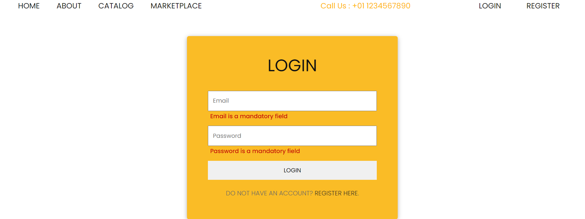
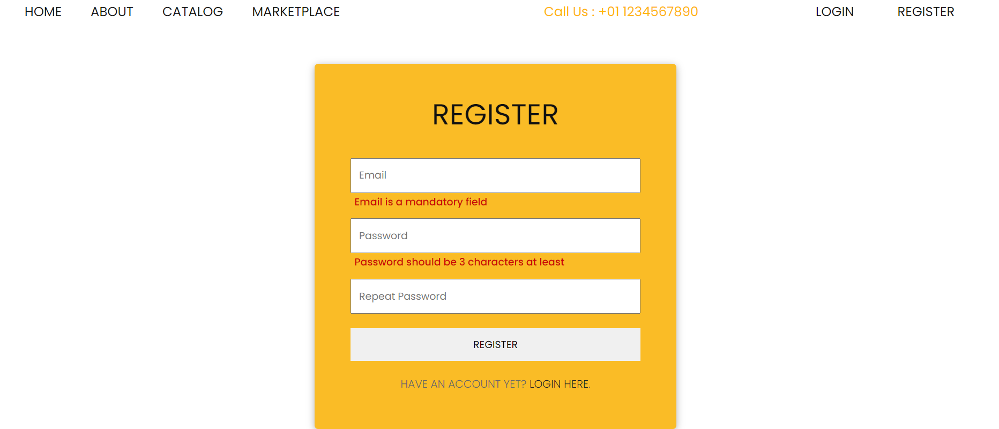
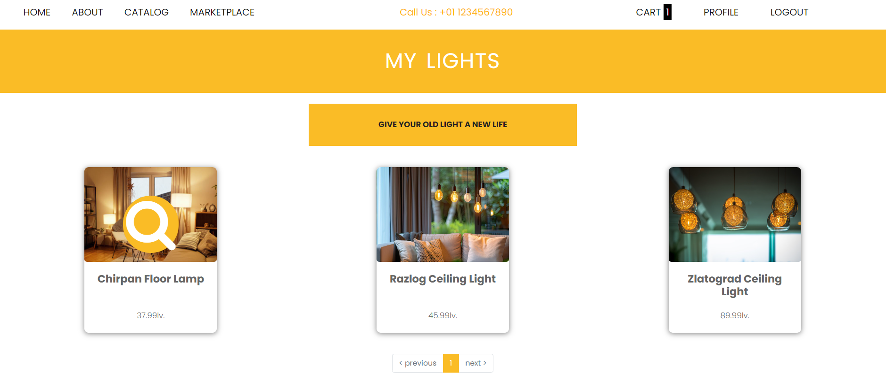

# Lights Store

Lights Store is a project built for SoftUni, React Exam. It is e-commerce website that offers new lights and registered users can offer their used lights. The project uses MongoDB to store the records and Firebase to store the images.

## Description

### The website has the following main pages: Home, About, Catalog and Markeplace. 
* #### The Home Page has a banner with a link to the Catalog Page, followed by information regarding the services that the company offers. 


* #### Then there are two links for Integrated LED and Bulb Type lights. The links lead to the Catalog Page and the lights are filtered automatically. 


* #### Next section is filled with the 8 newest comments left by users (guest and logged in). There is a slider that changes them every few seconds, but users can click the yellow buttons as well.


* #### Last sections are Footer and Copyright. The Footer consists of contact details, links to the pages available in the Header and a link leading to the Leave us a comment Page.


* #### Leave us a comment Page can be filled in by authenticated or guest users and has front-end and back-end validation for all fields. 


### Catalog Page shows all lights created by the Admin Account. Users(authenticated or guests) can click each light and see the detais. The page has search and sort options and uses pagination.


### Marketplace Page shows all lights created by all users. Users(authenticated or guests) can click each light and see the detais. The page has search and sort options and uses pagination.


### Login Page is available for not authenticated users and has front-end and back-end validation for all fields.


* #### If the email or the password are not correct, a toaster notification shows.


### Register Page is available for not authenticated users and has front-end and back-end validation for all fields. 


* #### The email has to be unique, if there is another user with the same email, a toaster notification shows.

 
 ### Authenticated users can access Cart and Profile Pages, and click the Logout Button.


### Cart Page shows all lights the user has added to their cart. The lights Ids are stored in MongoDB, which means that every time the user logges in, it shows the lights they added last time. The user has the option to see the details about the light. Also, they can remove the light by the link at the bottom of each light.


### Profile Page shows all lights created by the user. They can click each light and see the detais. The page uses pagination. It has the option to sell an old light by clicking the link 'Give your old light a new life'.


### Create Light Page shows a form that has front-end and back-end validation for all fields. When the light is created, it shows in the Profile Page.


### Details Page for guest users shows information about the light. When Buy button is clicked it leads to the Login Page.


### Details Page for authenticated users shows information about the light. Buy button shows if light has 1 or more quantities.


* ####  When Buy button is clicked, it shows a message saying that light has been added to the Cart. Quantities and Cart change straight away. 


### Details Page for authenticated users shows information about the light and out of stock message - when light has 0 quantities.


### Details Page for authenticated users shows information about the light in the Profile Page. It shows Edit and Delete buttons.


* #### Edit Page fills all fields automatically and has front-end and back-end validation for all fields.


* #### Delete Page shows a message where the user can choose to confrim or cancel the delete request.


## Getting Started

### Installing

* Clone the repository or download all files.

### Executing program
* Run Client
```
npm cd client
```
```
npm install
```
```
npm run dev
```

* Run Server
```
npm cd server
```
```
npm install
```
```
npm start
```
